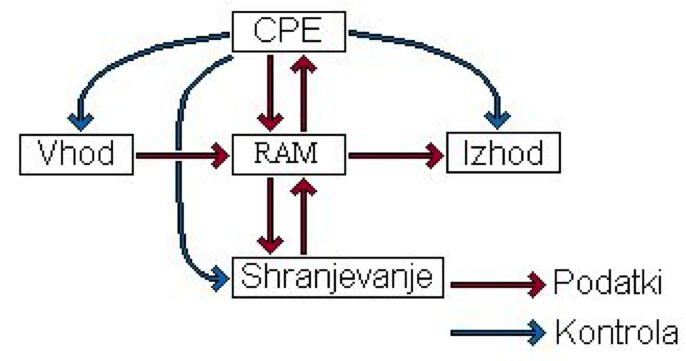
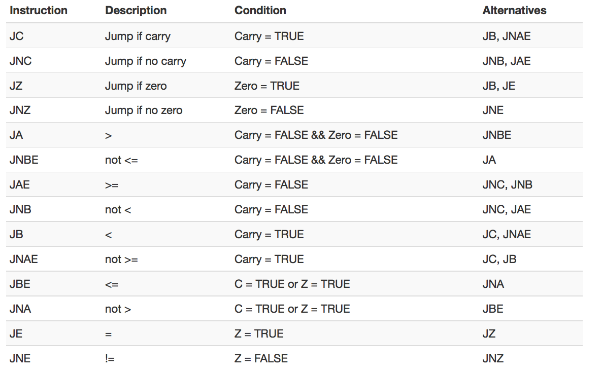

## Računalnik

-

- CPE – centralna procesna enota (mikroprocesor).
- RAM – začasni spomin (Random Access Memory).
- Vhodne enote – tipkovnica, miška, ...
- Izhodne enote – monitor, tiskalnik, ...
- Trajno shranjevanje – diski, DVD, USB ključi, oblak, ...

## Delovanje računalnika

- CPE kontrolira vse po programu, ki je v pomnilniku RAM, in po že vgrajenih protokolih.
- V spominu RAM so programi in podatki s katerimi trenutno dela CPE.
- Vhodne enote pišejo podatke na točno določena mesta v RAM-u. 
- Izhodne enote berejo podatke iz točno določenih mest v RAM-u.
- Enote za trajno shranjevanje trajno hranijo podatke in programe.

## Fizične komponente računalnika

- Mikroprocesor služi kot CPE.
- Matična plošča služi kot povezovalnik.
- RAM in CACHE spominski moduli služijo kot začasni pomnilnik.
- Trdi diski (magnetni, SSD), DVD, USB ključi, mrežni diski v oblaku (Dropbox, Google drive) služijo kot enote trajnega spomina.
- Zaslon (grafična kartica), USB vrata, zvočniki (zvočna kartica), tipkovnica, miška, ... služijo kot vhodno-izhodne enote.

## Kako deluje računalnik?

- Mikroprocesor vsebuje nekaj spominskih celic (registri), nad katerimi izvajamo aritmetično-logične operacije.
- RAM (spomin) je skladišče oštevilčenih spominskih celic. Vsaka celica hrani 1 Byte (zlog). Številkam celic pravimo *naslovi*.
- V delu RAM-a se nahaja zapis programa.
- Mikroprocesor sledi zapisu programa in izvaja ukaze.
- Ukazi so lahko:
    - nalaganje vsebine iz celic v registre ali obratno,
    - aritmetično logične operacije v registrih,
    - pogojne vejitve, skoki v programu (navadni, funkcijski).

## Programiranje računalnika

- Računalnik je "totalno neumen".
- Natančno in hitro lahko izvaja preproste operacije.
- Programiranje: manipuliranje z ukazi, da dosežemo da bo mikroprocesor naredil to kar hočemo, pri čemer se mikroprocesorju niti ne sanja, kaj v resnici dela.
- POMEMBNO: 
    - računalnik ne ve čisto nič - niti zase (nima zavesti);
    - s programiranjem ga zmanipuliramo, da naredi nekaj uporabnega, čeprav ne ve kaj v resnici dela;
    - računalnik sam po sebi ne premore nobene inteligence;
    - je pa zelo hiter.
    
## Današnji računalniki

- Koliko seštevanj lahko naredi današnji računalnik na sekundo?
- Kako hiter je procesor Intel® Core™ i7-4510U procesor (2,0 - 3,1 GHz)?
- $10^{10}$ seštevanj v sekundi ...
- Današnji računalnik ima tipično 8GB RAM (pribl. $8 \times 10^9$ zlogov). V toliko spomina lahko naložimo Biblijo več kot 1600-krat.

## Načini programiranja računalnikov

- Nizko nivojsko: 
    - strojna koda
    - **zbirnik** (tekstovni opis strojne kode)
- Višje nivojski programski jeziki
    - C/C++, Fortran (bližje konceptom delovanja računalnika) 
    - Java, C#, Haskell, ... (varnejši)
    - **Python**, R, Ruby, (bližje človeškim jezikom)
- Vsi programski jeziki se pred izvajanjem prevedejo v strojno kodo:
    - prevajalnik (compiler)
    - tolmač (interpreter)     
- Hour of Code - visoko nivojski način programiranja

## Simulator 8-bitnega računalnika

- Prvi mikroprocesor leta 1971 je bil 4-bitni.
- Prvi procesor v PC računalnikih je bil 8-bitni (Intel 8086 oz. 8088).
- Simulator: (http://schweigi.github.io/assembler-simulator/)
    - precej dobro zajame delovanje 8-bitnih procesorjev;
    - današnji procesorji so 64-bitni, a delujejo na zelo podoben način.

## Simulator 8-bitnega računalnika

- delovni registri `A`, `B`, `C` in `D`:
    - izvajanje in shranjevanje rezultatov aritmetično-logičnih operacij (seštevanje, primerjava, ...),
    - branje iz pomnilnika in pisanje vanj.
- register `IP` (_instruction pointer_):
    - kaže na trenutni ukaz v pomnilniku (hrani številko celice); 
    - po opravljenem ukazu se vrednost registra `IP` poveča (na naslednji ukaz);
    - vrednost `IP` lahko tudi spremenimo - izvajanje programa nadaljujemo na drugem delu.

    
## Simulator 8-bitnega računalnika
- register `SP` (_stack pointer_):
    - kaže na _sklad_, to je del pomnilnika, na katerega zaporedoma nalagamo vrednosti; 
    - vsakič, ko naložimo vrednost, se vrednost registra `SP` zmanjša, ko odstranimo vrednost pa poveča. 
- Zastavice `Z` (_zero_), `C` (_carry_) in `F` (_fail_):
     - hranijo en bit (logična vrednost);
     - odvisne so od rezultata zadnje izvedene operacije;
     - na podlagi njih se odločamo o skokih v programu.
- 256 zlogov RAM.
- Zadnjih 24 zlogov pripada izhodni enoti (simulacija zaslona).
- Zlog tik pred tem (naslov 231) je dno sklada.

## Ukazi zbirnika

- Splošna sintaksa:
- 
```{asm}
neobvezna_oznaka:  IME_UKAZA argumenti  ; neobvezen komentar
```
    - Preko oznake se lahko skličemo na naslov pomnilnika, kjer je ukaz.
    - Za imenom ukaza se lahko nahajajo z vejicami ločeni operandi. Teh je lahko 0, 1 ali 2.

## Operand je lahko

- Vsebina registrov `A`, `B`, `C`, `D`, `SP` (samo pri ukazu `MOV`).
- Vsebina v delovnih registrih interpretirana kot naslov, npr. `[A]`.
- Naslov v registru z odmikom: `[D-3]`.
- Konstanta: 0 ... 255.
- Konstanta interpretirana kot naslov, npr. `[100]`.
- Oznaka (interpretirana kot naslov).

## Ukaz `MOV`

-
Premikanje vsebine med registri in pomnilnikom (branje, pisanje).
-
```{asm}
MOV reg, reg
MOV reg, address
MOV reg, constant
MOV address, reg
MOV address, constant
```

## Aritmetične operacije

-
### Seštevanje in odštevanje: `ADD`,`SUB`
Operacije vplivajo na zastavici `Z` (zero) in `C` (prenos).
```{asm}
ADD reg, reg
ADD reg, address
ADD reg, constant
SUB reg, reg
SUB reg, address
SUB reg, constant
```
-
### Inkrementacija, dekrementacija: `INC`, `DEC`
Operacije vplivajo na zastavici `Z` (zero) in `C` (prenos).
```{asm}
INC reg
DEC reg
```

## Množenje, deljenje: `MUL`, `DIV`

- Množenje in deljenje registra `A` (akumulator) z vrednostjo. Vpliva na zastavice `Z` (zero), `C` (prenos) in  `F` (napaka, npr. deljenje z 0).
```{asm}
MUL reg
MUL address
MUL constant
DIV reg
DIV address
DIV constant
```

## Logične operacije

- Logične operacije vplivajo na zastavici `Z` (zero) in `C` (prenos).
-
```{asm}
AND reg, reg
AND reg, address
AND reg, constant
OR reg, reg
OR reg, address
OR reg, constant
XOR reg, reg
XOR reg, address
XOR reg, constant
NOT reg
```


## Premiki registrov: `SHL`, `SHR`
- Ekvivalent celoštevilskemu množenju z 2 oz. celoštevilskemu deljenju z 2. 
- Vplivajo na zastavici `Z` (zero) in `C` (prenos).
- 
```{asm}
SHL reg, reg
SHL reg, address
SHL reg, constant
SHR reg, reg
SHR reg, address
SHR reg, constant
```
## Primerjava: `CMP`

Ukaz CMP odšteje od prvega argumenta vrednost drugega:
```{asm}
CMP reg1, reg2
CMP reg1, constant
```

- Če sta vrednosti enaki, je rezultat 0 in se nastavi zastavica `Z`.
- Če je prva vrednost strogo manjša od druge, pride do "negativne" vrednosti oz. pojavi se prenos (zastavica `C`).
- Če je prva vrednost strogo večja od druge, se ne nastavi nobena od zastavic `C` oz. `Z`.

## Brezpogojni ali pogojni skoki

- 
### Brezpogojni skok
```{asm}
JMP address
```
-
### Pogojni skoki


## Funkcije

- Funkcija je del kode, na katere izvajanje začasno skočimo s klicem funkcije, kodo jo izvedemo in se po zaključku vrnemo na del kode takoj po klicu funkcije.
-
### Klic funkcije: `CALL`.
    - Na sklad shrani naslov naslednjega ukaza in `IP` nastavi na začetek funkcije
```{asm}
CALL address
```
-
### Vračanje iz funkcije: `RET`
    - Iz sklada prebere vrednost v `IP` in nadaljuje izvajanje programa.
```{asm}
RET
```

## Delo s skladom

### Nalaganje na sklad
Na sklad shranimo vsebino registra, naslov ali konstanto. Pri tem se `SP` zmanjša za 1.
```{asm}
PUSH reg
PUSH constant
```

### Odstranjevanje s sklada
Vsebina na naslovu `SP` se zapiše v register. Vrednost `SP` se poveča za 1.
```{asm}
POP reg
```

## Zaključek programa

Program zaključimo z ukazom `HLT`.

## Hello world! {.smaller}
```
; Simple example
; Writes Hello World to the output

          JMP start
hello:    DB "Hello World!"     ; Variable
          DB 0                  ; String terminator

start:    MOV C, hello          ; Point to var 
          MOV D, 232            ; Point to output
          CALL print
          HLT                   ; Stop execution

print:    PUSH A                ; print(C:*from, D:*to)
          PUSH B
          MOV B, 0
.loop:    MOV A, [C]            ; Get char from var
          MOV [D], A            ; Write to output
          INC C
          INC D  
          CMP B, [C]            ; Check if end
          JNZ .loop             ; jump if not
          POP B
          POP A
          RET
```
## [Minimalni element v tabeli](viri/minimum.asm) {.smaller}
```
; Najmanši element v zaporedju (tabeli)

          JMP start
stev_el:  DB 5     ; Število elementov v tabeli
tabela:   DB 7     ; Tabela
          DB 2
          DB 8
          DB 3
          DB 5
min:      DB 0     ; Na koncu bo tu min	

start:    MOV C, tabela	      ; Naslov začetka tabele 
          ADD C, [stev_el]    ; Naslov zadnjega elementa + 1
          MOV A, tabela       ; Kazalec na začetek tabele
          MOV B, [tabela]     ; V B trenutni min
          INC A               ; Premik kazalca za en element
.zanka:   CMP A, C            ; Ali je kazalec A presegel tabelo?
          JZ konec            ; Če je, končamo zanko
          CMP B, [A]          ; Ali smo našli manjši element 
          JBE povec           ; Če nismo, ...
          MOV B, [A]          ; sicer ga zapišemo v B
povec:    INC A               ; Premik kazaleca naprej
          JMP .zanka          ; Ponovimo zanko
	
konec:    MOV [min], B        ; Shranimo min
          HLT

````

## [Urejanje z izbiranjem](viri/uredi.asm) {.smaller}
```
; Urejanje z izbiranjem

          JMP start
stev_el:  DB 5        ; Število elementov v tabeli
tabela:	  DB 7        ; Tabela
          DB 2
          DB 8
          DB 3
          DB 5

; rabimo C za konec, A za start, B za min

start:    MOV A, tabela      ; Začetek tabele
          MOV C, tabela
          ADD C, [stev_el]  ; Konec tabele + 1
          CALL uredi        ; Klic funkcije
          HLT          
```

## Urejanje z izbiranjem - najdi {.smaller}
```
; najdi: A - začetek, C - konec + 1, B - pozicija najmanjšega elementa

najdi:    PUSH A	          ; Shranimo morebitne stare vrednosti
          PUSH D
          MOV B, A	   
          INC A		          ; Premaknemo A na 2. element
.zanka:   CMP A, C          ; Ali je kazalec v A že presegel tabelo
          JZ konec1         ; Če je, končamo zanko
          MOV D, [B]
          CMP D, [A]	
          JBE povec         ; Če ne (B <= [A]) si ga ne zapomnimo
          MOV B, A          ; Sicer pa ga zapišemo v B
povec:    INC A	            ; Premaknemo kazalec za eno mesto naprej
          JMP .zanka        ; Ponovimo zanko
konec1:   POP D		; Obnovimo stare vrednosti 
          POP A
          RET
```

## Urejanje z izbiranjem - uredi {.smaller}
```
; Urejanje: A - začetek tabele, C - konec + 1,   
; A bo trenutna pozicija v tabeli
uredi:    PUSH A		; shranjevanje registrov
          PUSH B
          PUSH D
.zanka2:  CMP A, C 	; je A dosegel C?
          JZ konec2
          CALL najdi	; najdi minimum
          MOV D, [A]	; zamenjava minimuma z [B]
          PUSH C
          MOV C, [B]
          MOV [A], C
          MOV [B], D
          POP C
          INC A		; pomik po tabeli naprej
          JMP .zanka2
konec2:   POP D		; obnova registrov
          POP B
          POP A
          RET
```