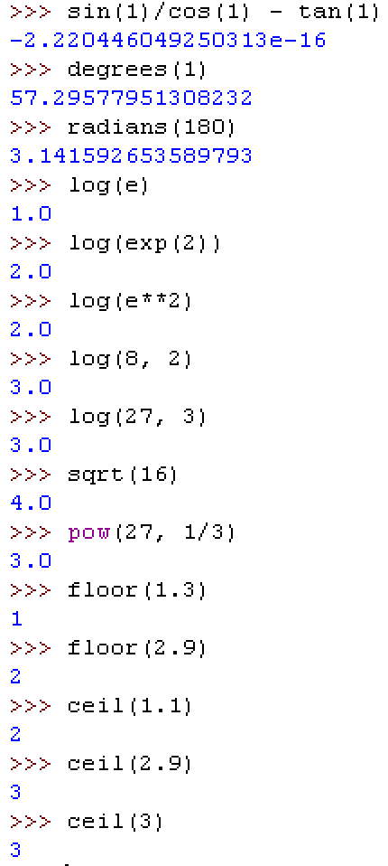

## Python
- Splošno namenski visoko nivojski programski jezik.
- Poudarek na berljivosti in preglednosti.
- Podpira različne stile programiranja: *objektno-orientirano*, *imperativno* in *funkcijsko*.
- Guido van Rossum, konec 1980-ih let.
- Odprta koda.
- Python 2.0 leta 2000. Python 2.7 se uporablja v veliko produkcijskih sistemih.
- Python 3.0 leta 2008. Danes: Python 3.4.x
- Vključuje: dinamično tipiziranje, avtomatično čiščenje spomina (ang. garbage collector), veliko znanstvenih knjižnic, ...

## Namestitev in okolje IDLE

- Osnovno delovno okolje IDLE je že vključeno v namestitev.
- [Namestitev Pythona 3.1 v Windows XP](http://www.nauk.si/materials/87/out/index.html#state=2)
- [Namestitev in uporaba okolja IDLE](http://www.nauk.si/materials/637/out/index.html#state=2)
- <font size=2px>Povezave na naslovih vodijo do animacij.</font>

## Osnovni tipi/razredi in objekti
- Vsak podatek v Pythonu je objekt.
- *Objekt* združuje podatke (atribute) in operacije (metode) nad njim.
- Tip objekta določa *razred* objekta (definicija/tip objekta).
- Osnovni tipi:
    - `int` - celo število (`1`, `1023`).
    - `float` - realno število (`2.1`, `1.1e10`, `1e-3`)
    - `bool` - logična vrednost (`True` ali `False`).
    - `str` - niz - zaporedje znakov v enojnih ali dvojnih narekovajih (`"niz niz"`, `'niz'`, `"'niz'"`, `'niz\nniz'`).

## [Osnovni tipi](http://www.nauk.si/materials/636/out/index.html#state=2)


## Osnovni tipi in pretvorbe (`int`)


## Osnovni tipi in pretvorbe (`float`)


## Osnovni tipi in pretvorbe (`bool`)


## Osnovni tipi in pretvorbe (`str`)


## [Objekti, metode, notranje spremenljivke (atributi) in lastnosti](http://www.nauk.si/materials/638/out/index.html#state=2)  


## [Cela števila (`int`) in aritmetične operacije](http://www.nauk.si/materials/641/out/index.html#state=2)

- Osnovni aritmetični operatorji:
    - `+` (vsota)
    - `-` (razlika)
    - `*` (produkt)
    - `**` (potenca)
    - `/` (količnik, v realnih številih)
    - `//` (celi del količnika)
    - `%` (ostanek pri celoštevilskem deljenju)

## Cela števila (`int`) in aritmetične operacije


## Cela števila (`int`) in aritmetične operacije


## [Realna števila (`float`)](http://www.nauk.si/materials/731/out/index.html#state=2)


## Realna števila (`float`)


## [Kompleksna števila](http://www.nauk.si/materials/696/out/index.html#state=2)


## [Nizi](http://www.nauk.si/materials/724/out/index.html#state=2)


## Nizi


## [Logične vrednosti in logični operatorji](http://www.nauk.si/materials/705/out/index.html#state=2)


## Logične vrednosti in logični operatorji


## [Sestavljeni logični izrazi](http://www.nauk.si/materials/706/out/index.html#state=1)


## Sestavljeni logični izrazi


## [Spremenljivke](http://www.nauk.si/materials/640/out/index.html#state=2)


## Spremenljivke


## [Moduli in modul `math`](http://www.nauk.si/materials/697/out/index.html#state=1)


## Modul `math`



## [Primer: Določanje števk števila](http://www.nauk.si/materials/692/out/index.html#state=2)


## [Primer: Sestavljanje števila iz števk)](http://www.nauk.si/materials/694/out/index.html#state=2)


## [Primer: Pretvorba yardov v metre, decimetre...](http://www.nauk.si/materials/695/out/index.html#state=2)


## [Izpisovanje na zaslon](http://www.nauk.si/materials/704/out/index.html#state=2)


## Izpisovanje na zaslon


## [Interaktivno branje od uporabnika](http://www.nauk.si/materials/729/out/index.html#state=2)


## [Pogojni stavek `if`](http://www.nauk.si/materials/707/out/index.html#state=2)


  


## [Pogojni izraz](http://www.nauk.si/materials/711/out/index.html#state=2)


## Na katerem intervalu je število
- [1.del](http://www.nauk.si/materials/710/out/index.html#state=1)
-


- [2.del](http://www.nauk.si/materials/709/out/index.html#state=1)
-


## [Primer: prestopno leto](http://www.nauk.si/materials/708/out/index.html#state=1)


## [Zanka `while`](http://www.nauk.si/materials/725/out/index.html#state=2)


- Meči kocko in izpisuj.

## Zanka `while`


- Meči kocko, izpisuj, prekini zanko, ko vržeš prvo šestico.

## Zanka `while`


- Meči kocko, izpisuj, štej mete, dokler ne vržeš prve šestice. Potem izpiši, koliko metov si potreboval.

## Zanka `while`


- Meči kocko, izpisuj, štej mete, dokler ne vržeš prve šestice. Potem izpiši, koliko metov si potreboval. Namesto `break` uporabimo pogoj za zanko.

## Tabeliraj kvadrate števil od 1 od 10.

```{python}
n = 10 # izpisujemo n vrstic 
i = 0
while i < n:
    i += 1 
    print(i,i**2)
```

## Preveri, ali je število praštevilo. 
```{python}
n = 23
p = 2
jeAliNi = True
while p*p < n:
    if n % p == 0:
        jeAliNi = False
        break
    p += 1
if(jeAliNi):
    print(n, "je praštevilo")
else:
    print(n, "ni praštevilo")
```

## Izračun kvadratnega korena z iteracijo.

Uporabimo iterativno formulo $x_{n+1} = (x_n + \frac{a}{x_n})$.
```{python}
a = 3 # računamo koren iz 3
eps = 0.0000001
x = 1
y = (x + a/x)/2
while abs(y - x) > eps:
    x = y
    y = (x + a/x)/2
print(y)

from math import *
print(sqrt(a))
```

## Na zaslon nariši trikotnik
```{python}
i = 0
while i < 5:
    j = 0
    while j < i + 1:
        print("*", end="")
        j += 1
    print()
    i += 1
```