## Funkcije kot objekti

- Funkcije se obnašajo kot objekti.
-
```{python}
>>> a = min
>>> a(3,1,2)
1
```
- Pod imenom funkcije se skriva objekt.
- Objekt, ki predstavlja funkcijo, je prirejen imenu funkcije.
- Pod imenom ("v spremenljivki) `min` je objekt, ki predstavlja funkcijo `min`.
- Ta objekt shranimo tudi v spremenljivko `f`.
- Klic funkcije je dejansko uporaba operatorja `(...)` nad objektom (funkcijo) v spremenljivki.

## Anonimne funkcije

- Ustvarimo lahko funkcije, ki nimajo imena (torej niso v nobeni spremenljvki)
- 
```{python}
>>> (lambda x,y: x + y)(3, 4)
7 
```
- `lambda: x, y: x + y` - funkcija, ki ima dva argumenta, `x` in `y` in vrne njuno vsoto.
- Ukaz `lambda` določa, da gre za definicijo funkcije.
- Za ukazom naštejemo argumente; sledi dvopičje in izraz, ki lahko uporabi argumente. 
- Funkcija vrne rezultat izraza.

## Funkcije kot argumenti

- Tako kot vse objekte, lahko funkcijo podamo kot parameter drugi funkciji.
- 
```{python}
>>> def sestej(a, b):
            return a + b
>>> odstej = lambda a, b: a - b
>>> def izvedi(f, a, b):
            return f(a,b)
>>> izvedi(sestej, 3, 4)
7
>>> izvedi(odstej, 3, 4)
-1
```

## Funkcije v funkcijah

- Funkcije lahko definiramo tudi znotraj funkcij ter jih uporabimo.
-
```{python}
def operacija(oper, a, b):
        def sestej(a, b): return a + b
        def odstej(a, b): return a - b
        if oper == "+": return sestej(a, b)
        elif oper == "-": return odstej(a, b)
```
-
```{python}
>>> operacija("+", 3, 4)
7
```
-
```{python}
>>> operacija("-", 3, 4)
-1
```
- Seveda lahko vzorec ponavaljamo in definiramo funkcije znotraj funkcij, ki so znotraj funkcij, ...

## Vračanje funkcij

- Ker so funkcije navadni objekti, jih lahko tudi vračamo.
- 
```{python}
def potenca(n):
        def potenciraj(a):
            return a**n
        return potenciraj
```
-
```{python}
>>> kvadrat = potenca(2)
>>> kvadrat(4)
16
```
-
```{python}
>>> kub = potenca(3)
>>> kub(3)
27
```

## Zaprtja funkcij {.smaller}

- 
```{python}
def dvojna_potenca(n):
        x = 2*n
        def potenciraj(a):
            return a**x
        return potenciraj
```
-
```{python}
x = 7
>>> kvadrat = dvojna_potenca(1)
```
- Kateri `x` uporabi funkcija `kvadrat` v času klica?
-
```{python}
>>> kvadrat(4)
16
```
- Ko funkcija `potenca` vrne funkcijo, ki uporablja njene lokalne spremnljivke, ji še hkrati (kot objektu) "pripne" še trenutne vrednosti lokalnih spremenljivk, ki jih vrnjena funkcija uporablja.
- S tem *zaprtjem* (ang. closure) postane vrnjena funkcija avtonomna.

## Rekurzija {.smaller}

- Kako izračunamo vsoto števil od 1 do $n$?
- Izračunamo vsoto od 1 do $n - 1$ in potem prištejemo še $n$.
```{python}
def vsota(n):
        return vsota_do_n_minus_1(n) + n
```
- Kako pa naprogramiramo funkcijo `vsota_do_n_minus_1`?
- To je ista funkcija, kot če bi uporabili začetno funkcijo s parametrom `n - 1`.
- 
```{python}
def vsota(n):
        return vsota(n - 1) + n
```
- Šefovski pristop: naredi nekaj malega in predaj delo drugemu.
- Drugi naj dela točno tako kot ti.
- Kdaj se pa predajanje konča?
- Ko je problem dovolj majhen, ga lahko kar rešimo in nehamo predajati.

## Rekurzija

- Polno navodilo pravi:
     - če je problem dovolj majhen, ga kar reši.
     - sicer nekaj naredi (prištej eno število) in predaj reševanje podrejenim.
- Pravilu, za reševanje (dovolj) enostavnega problema rečemo *zaustavitveni pogoj*.
-
```{python}
def vsota(n):
        if n == 1: return 1
        return vsota(n - 1) + n
```
- Uporabi (klicanju) iste funkcije v sami definiciji funkcije rečemo *rekurzija*.
- Rekurzija = samoponavljanje.

## Rekurzija: Izpis števil od a do b {.smaller}

- Kako rekurzivno izpisati vsa števila na intervalu od $a$ do $b$?
- **Prvi način:** Izpiši prvo število, nekdo drug pa naj izpiše števila od $a + 1$ do $b$, če je $a + 1 \leq b$ (to je spet isti problem!).
- 
```{python}
def izpisi(a, b):
        if a <= b:
            print(a)
            izpisi(a + 1, b)
```
- **Drugi način:** Če interval vsebuje samo eno število, ga bom izpisal. Če ne, dam prvo polovico intervala izpisati nekomu, drugo pa nekomu drugemu (dva problema istega tipa).
-
```{python}
def izpisi2(a, b):
        if a == b:
            print(a)
        elif a < b:
            sredina = (a + b)//2
            izpisi2(a, sredina)
            izpisi2(sredina + 1, b)
```

## Ali je dano število praštevilo? {.smaller}

- Včasih si je potrebno postaviti vprašanje na pravilen način.
- Ali je med številom `p` in kvadratnim korenom iz `n` kak delitelj števila `n`?
- 
```{python}
def je_delitelj(p, n):
        if p*p <= n:
            return n % p == 0 or je_delitelj(p + 1, n)
        return False 
```
- Uporaba te funkcije ni tako priročna za preverjanje praštevilskosti.
- 
```{python}
>>> not je_delitelj(2, 23)
True
```
- Uporabimo pomožno "ovojno" funkcijo.
- 
```{python}
def je_prastevilo(n):
        def je_delitelj(p, n):
            if p*p <= n:
                return n % p == 0 or je_delitelj(p + 1, n)
            return False    
        return not je_delitelj(2, n)
```
-
```{python}
>>> je_prastevilo(23)
True
```

## Želvja grafika 

- Želvja grafika predstavlja koncept uporabe računalniške grafike z uporabo namišljene "želve", ki se sprehaja in pušča sled. 
- Modul `turtle` vsebuje razrede in metode povezane z upravljanjem želve in grafičnega prikaza.
-
```{python}
>>> import turtle
```
- Izris se prikaže na zaslonu, ki je predstavljen z objektom razreda `TurtleScreen`
```{python}
zaslon = turtle.Screen()
```
- Želva je predstavljena z objektom razreda `Turtle`.
-
```{python}
zelva = turtle.Turtle()
```

## Želvja grafika {.smaller}

- Želvo upravljamo z različnimi ukazi.
```{python}
>>> zelva.forward(100)
>>> zelva.left(90)
>>> zelva.forward(200)
```
-
<p align="center">
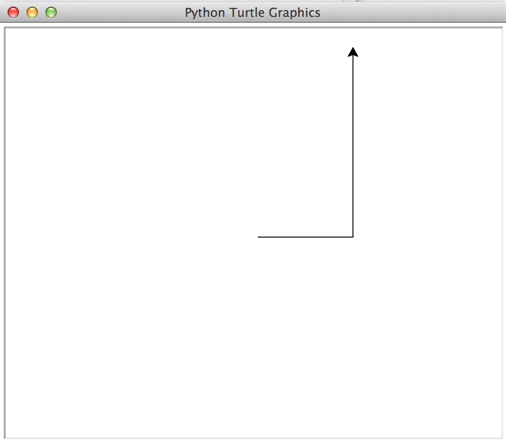
</p>
- Dokumentacija o možnih ukazih (metodah) na zaslonu in na želvi je na voljo na:
https://docs.python.org/3.4/library/turtle.html

## Trikotnik {.smaller}
 
```{python}
>>> import turtle
>>> zaslon = turtle.Screen()
>>> zaslon.bgcolor("lightgrey")  # barva ozadja
>>> zaslon.title("Želvica")      # naslov okna
>>> zelva = turtle.Turtle()
>>> zelva.color("red")           # barva črte
>>> zelva.pensize(3)             # debelina črte
>>> zelva.forward(100)
>>> zelva.left(120)
>>> zelva.forward(100)  
>>> zelva.right(60)
>>> zelva.backward(100)          # želva gre lahko tudi nazaj
```

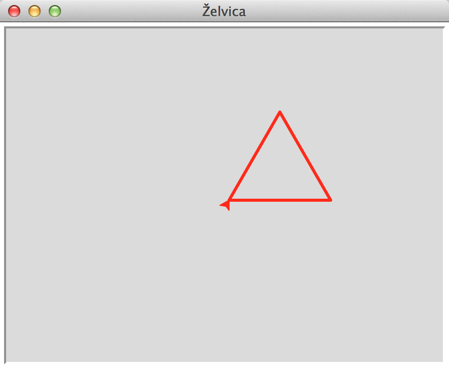

## Večkotnik

- Želimo narisati poljuben večkotnik z dano dolžino stranice.
- Kako se giblje želva?
- Naprej za dolžino stranice, zavij v levo za "določen kot", ponovi $n$-krat.
- "Določen kot" je ravno $360/n$ stopinj.
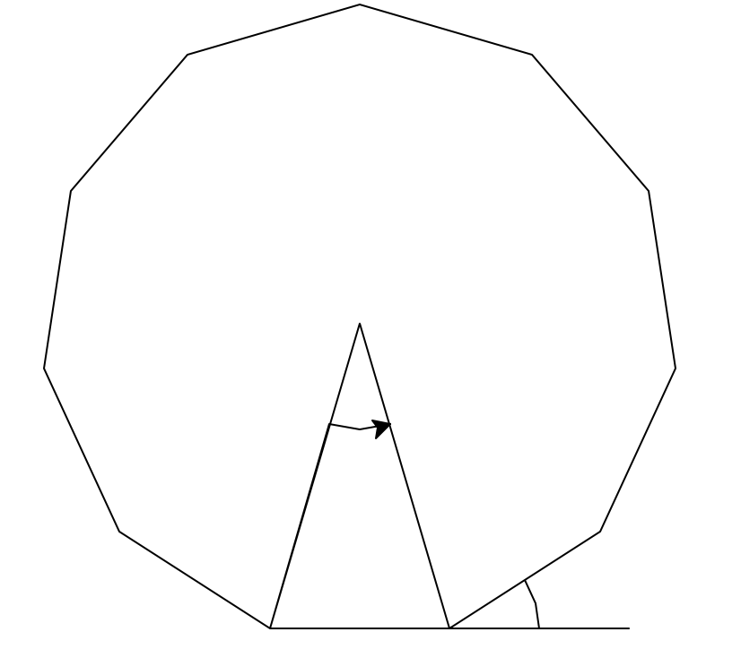

## Večkotnik {.smaller}

-
```{python}
def veckotnik(zelva, n, stranica=100, debelina=2):
        kot = 360/n
        i = 0
        while i < n:
            zelva.fd(stranica)
            zelva.left(kot)
            i += 1
```
- 
```{python}
>>> import turtle
>>> zaslon = turtle.Screen()
>>> zelva = turtle.Turtle()
>>> veckotnik(zelva, 5)
```
-
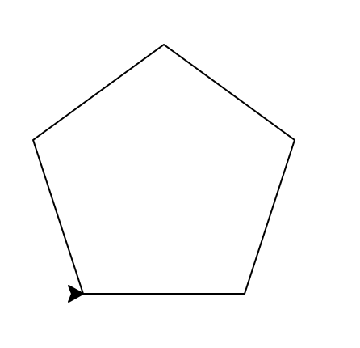

## Večkotnik - kako smo narisali skico {.smaller}

```{python}
n = 11
d = 100
kot = 360/n
drugi_kot = (180 - kot)/2
veckotnik(zelva, n, stranica=d)
input("Pritisni tipko ...")
zelva.fd(2*d)           # podaljšaj stranico
zelva.bk(d/2)           # sredina podaljška
zelva.left(90)          # obrni se v smeri loka
zelva.circle(d/2, kot)  # nariši kotni lok
zelva.left(90)          # obrni s v smeri dotaknjene stranice
zelva.fd(d/2)           # vrni se v drugi vogal strnice
zelva.right(kot + drugi_kot) # obrni s proti središču
radij = d/2 / cos(radians(drugi_kot))  # izračunaj radij (pazi: radiani!)
zelva.fd(radij)         # prva stranica kota
zelva.right(kot)        # obrat za drugo stranico
zelva.bk(radij)         # druga stranica kota
zelva.fd(radij*2/3)     # risanje kotnega loka
zelva.right(90)
zelva.circle(radij/3, kot)
```


## Rožica {.smaller}

- Če je želva na začetku orientirana pod drugačnim kotom, je večkotnik na koncu tudi zavrten pod tem kotom.
- Rožico lahko narišemo preko risanja večih zavrtenih večkotnikov.
-
```{python}
def rozica(nlistov, n):
        zaslon = turtle.Screen()
        zelva = turtle.Turtle()
        zelva.speed("fastest")    # riše hitro
        kot = 360/nlistov
        i = 0
        while i < nlistov:
            zelva.left(kot)
            veckotnik(zelva, n)
            i += 1
```
-
```{python}
>>> rozica(15, 5)
```
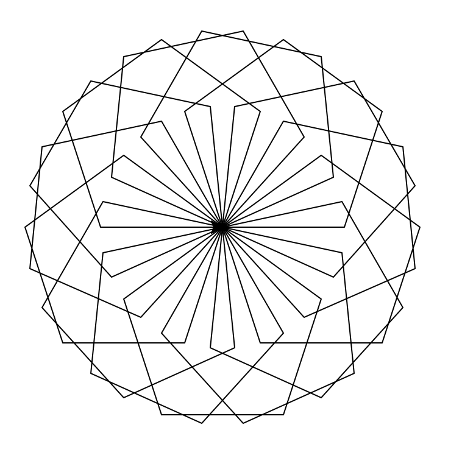

## Zapolnjen večkotnik {.smaller}

- Narišimo zapolnjen kvadrat.
- Lomljenka omejuje nek poligon (če še sklenemo zadnjo in prvo točko).
- Z metodama `begin_fill()` ter `end_fill()` povemo, katera lomljenka določa poligon, katerega površina naj se obarva.
- Z metodo `fill_color()` lahko pridobimo trenutno barvo za zapolnjevanje ali pa nastavimo novo barvo.
- 
```{python}
def zapolnjen_veckotnik(zelva, n, stranica=100, debelina=2, barva="yellow"):
        stara_barva = zelva.fillcolor()  # shranimo morebitno nastavljeno barvo
        zelva.fillcolor(barva)           # nastavimo barvo
        zelva.begin_fill()               # začetek poligona
        veckotnik(zelva, n, stranica, debelina)
        zelva.end_fill()                 # konec poligona
        zelva.fillcolor(stara_barva)    # vrnemo nastavitev barvne v prvotno stanje
```

## Kaj še lahko počnemo z želvo?

- Ko želva potuje, lahko za sabo pušča sled ali ne (metodi `up()` in `down()`).
- Lahko pa pušča tudi pečat svoje oblike (metoda `stamp()`).
- Želva lahko takoj skoči na neko koordinato (metoda `goto(x,y)`).
- Lahko razveljavimo zadnjo akcijo želve (metoda `undo()`).
- Lahko izvemo trenutne koordinate in usmeritev želve (metode `position()` in `heading()`).
- Prepričamo lahko želvo, da dojema koordinate v radianih ali stopinjah (metodi `radians()` in `degrees()`).
- Nastavimo ali izvemo stanje glede risanja in grafike (metode `isdown()`, `width()`, `color()`).
- Želvi lahko tudi spremenimo izgled (metoda `shape()`).

## Primer {.smaller}

```{python}
import turtle

def crtkano(zelva, n, crta=20, prazno=10):
    if n == 0: return
    zelva.down(); zelva.fd(crta); zelva.up()  # crtica
    zelva.fd(prazno)                          # presledek
    crtkano(zelva, n - 1, crta, prazno)       # rekurzivna "zanka"

def zelvasto(zelva, n, skok=30):
    i = 0
    zelva.shape('turtle')   # navadna zanka
    while i < n:
        zelva.stamp(); zelva.fd(skok)
        i += 1
        
def test(n):
    zaslon = turtle.Screen()
    zelva = turtle.Turtle()
    zelva.speed(0); zelva.hideturtle(); zelva.up()
    zelva.goto(-200, 150); crtkano(zelva, n)
    zelva.goto(-200, 100); zelvasto(zelva,n)
    print("Položaj želve je:", zelva.position())
```

## Primer

```{python}
>>> test(15)
Položaj želve je: (250.00,100.00)
```
<p align="center">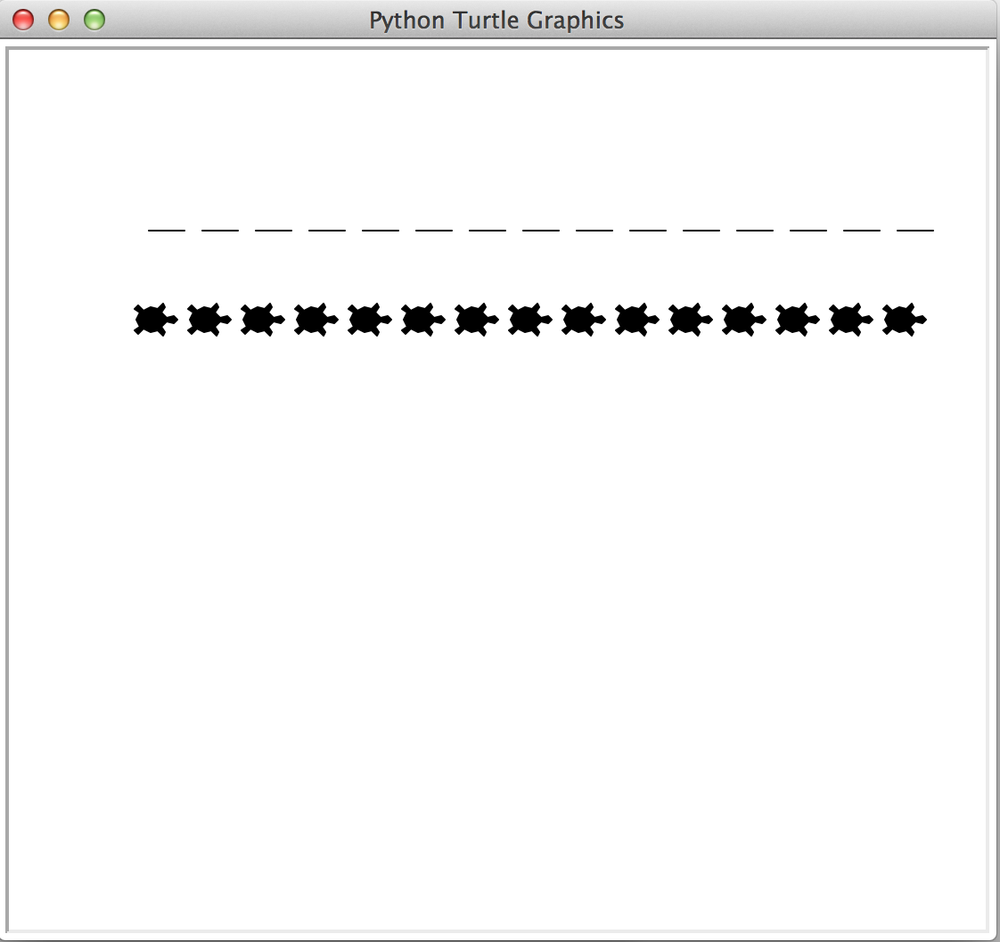</p>

## Kochova snežinka {.smaller}

- *Fraktalna krivulja* je krivulja, ki je definirana s pomočjo samoponavljanja istega vzorca na manjših skalah.
- Kochova snežinka:
    - red 1: črta
    - red 2: na črti zraste enakostranični trikotnik
    - red 3: na vsaki ravni črti nad redom 2 zraste enakostranični trikotnik
    - ...
-
<p align="center"> 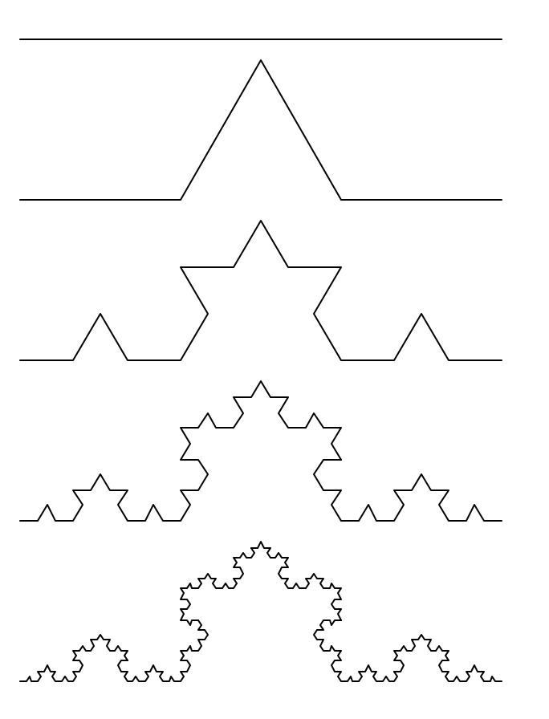 </p>

## Kochova snežinka {.smaller}

- <p align="center">  </p>
- Pred začetkom risanja si nekam usmerjen.
- Po koncu risanja si usmerjen v isto smer.
- Dana je dolžina snežinke $d$.
- Vmes narišeš snežinko reda $n$ dolžine $d$.
- Vsakič je vzorec isti:
    - ravno snežinka reda $n-1$, dolžine $\frac{d}{3}$,
    - zavij levo 60 stopinj,
    - ravno snežinka reda $n-1$, dolžine $\frac{d}{3}$,
    - zavij desno 120 stopinj,
    - ravno snežinka reda $n-1$, dolžine $\frac{d}{3}$,
    - zavij levo 60 stopinj,
    - ravno snežinka reda $n-1$, dolžine $\frac{d}{3}$.
    
## Kochova snežinka {.smaller}

-
```{python}
def koch(zelva, red, velikost):
        """Nariše kochovo snežinko danega reda in velikosti z želvo. """
        if red == 0:          # Ravna črta
            zelva.forward(velikost)
        else:
            koch(zelva, red-1, velikost/3)   
            zelva.left(60)
            koch(zelva, red-1, velikost/3)
            zelva.right(120)
            koch(zelva, red-1, velikost/3)
            zelva.left(60)
            koch(zelva, red-1, velikost/3)
```
-
```{python}
def prava_kochova_snezinka(red, velikost, start=(0,0)):
        zaslon = turtle.Screen()
        zelva = turtle.Turtle()
        zelva.hideturtle(); zelva.speed(0)
        zelva.up(); zelva.goto(*start); zelva.down()
        zelva.left(60)
        i = 0
        while i < 3:
            koch(zelva, red, velikost)
            zelva.right(120)
            i += 1
```
- 
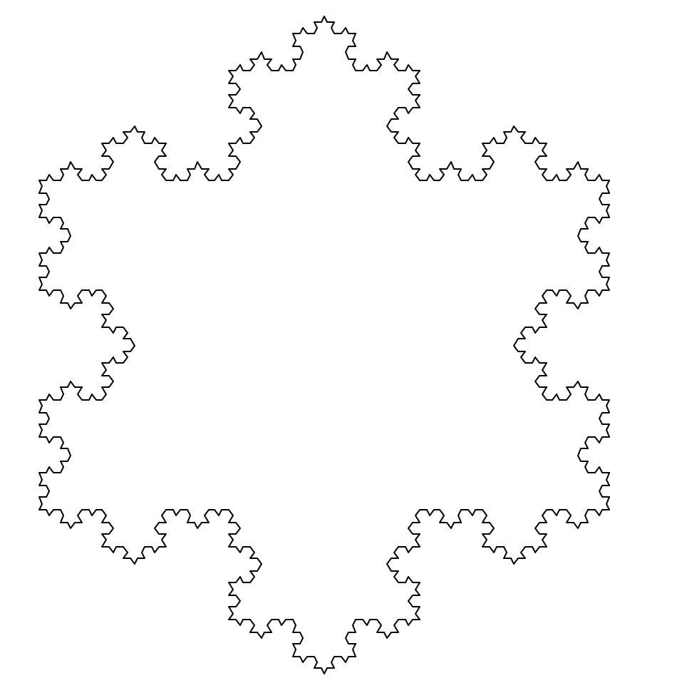

## Drevo

- Drevesa izgledajo fraktalno: deblo se razdeli na veje, na vejah se zgodba ponovi (veja izgleda kot pomanjšano drevo).
- Kako narišemo drevo:
    - narišemo ravno vejo,
    - ob stani ali na vrhu narišemo stranske veje.
- Mi bomo narisali samo glavno vejo in potem na vrhu dve stranski pod danima kotoma.
- 
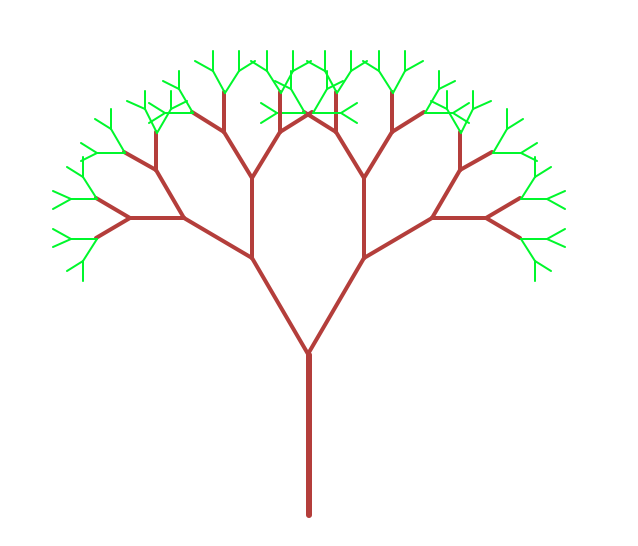

## Drevo {.smaller}

```{python}
import turtle, random
from math import *

def drevo(zelva, red, velikost, faktor, kot):                    
        if red == 0: return
        if red <= 2:    # majhna drevesčka bodo zelena (listi)
            zelva.pencolor("green")
        else:
            zelva.pencolor("brown")
        zelva.pensize(log(2*red))  # tanjšanje vej
        zelva.down()
        zelva.forward(velikost)  # osnovna veja
        zelva.right(kot)         # prva izrasla veja
        drevo(zelva, red - 1, velikost*faktor, faktor, kot)
        zelva.left(2*kot)        # druga izrasla veja v drugo stran
        drevo(zelva, red - 1, velikost*faktor, faktor, kot)
        zelva.right(kot)         # vrnitev v koren
        zelva.up()
        zelva.backward(velikost)
```

## Drevo

```{python}
def test(n):
    zaslon = turtle.Screen()
    zelva = turtle.Turtle()
    zelva.speed(0); zelva.hideturtle()
    zelva.left(90)     # smer rasti drevesa
    drevo(zelva, n, 80, 0.7, 30) 

test(8)
```
<p align="center">
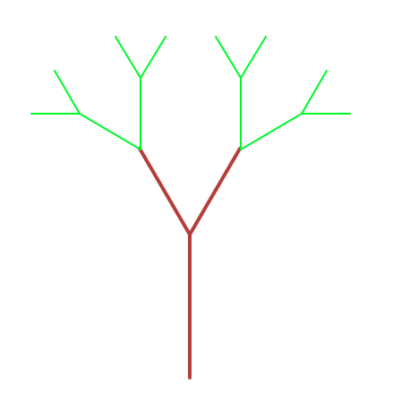
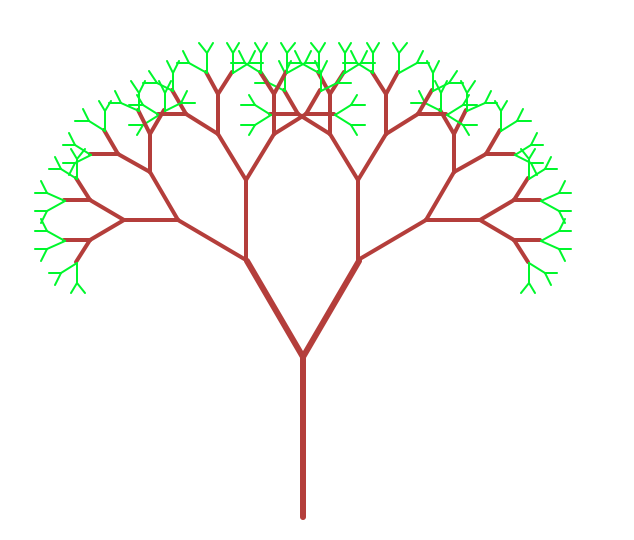
</p>