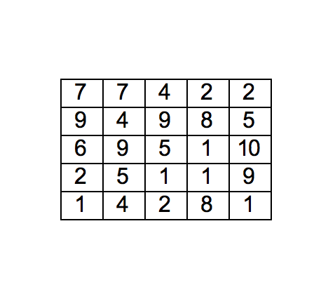

## Seznami  {.smaller}

- Seznam je *podatkovna struktura*, ki hrani urejeno zaporedja objektov.
- Ustvarjanje seznama (prazen seznam).
-
```{python}
>>> sez = []
>>> print(sez)
[]
```
- 
```{python}
>>> sez = [1, 2, 3]
>>> print(sez)
[1, 2, 3]
>>> sez = [1,      2,3]
>>> print(sez)
[1, 2, 3]
```
- Seznami so razreda (tipa) `list`.
-
```{python}
>>> type(sez)
<class 'list'>
```
- Elementi seznama so lahko objekti različnih razredov.
-
```{python}
>>> sez = [2, "a", True, 4.1, (1,2,3), [2,1]]; print(sez)
[2, 'a', True, 4.1, (1, 2, 3), [2, 1]]
```


## Seznami - dostop do elementov {.smaller} 

- Dolžino seznama izračunamo s funkcijo `len()`.
-
```{python}
>>> sez = [3, 2, 1, 5, 2]
>>> len(sez)
5
```
- Do elementov seznama dostopamo z operatorjem `[]`.
-
```{python}
>>> sez[0]   # prvi element
3
```
-
```{python}
>>> sez[1]   # drugi element
2
```
-
```{python}
>>> sez[len(sez) - 1]  # zadnji element
2
```
-
```{python}
>>> sez[-1]  # zadnji element (negativno indeksiranje "za nazaj")
2
```
-
```{python}
>>> sez[-len(sez)] # prvi element
3
```

## Seznami - dodajanje in vstavljanje {.smaller}

-
```{python}
>>> s = [3, 2, 1, 5, 2, 1, 2]; print(sez)
[3, 2, 1, 5, 2, 1, 2]
```
- Dodajanje elementa na konec seznama - `append()`.
- 
```{python}
>>> sez.append(4); print(sez)
[3, 2, 1, 5, 2, 1, 2, 4]
```
- Vstavljanje na mesto z danim indeksom  - `insert()`.
```{python}
>>> sez.insert(0, 5); print(sez)
[5, 3, 2, 1, 5, 2, 1, 2, 4]
>>> 
```
- Element vstavimo na dan indeks, ostali elementi se zamaknejo eno mesto naprej.

- Vstavljanje na tretje mesto (indeks 2).
-
```{python}
>>> sez.insert(2, 7); print(sez)
[5, 3, 7, 2, 1, 5, 2, 1, 2, 4]
```

## Seznami - popravljanje, odstranjevanje {.smaller}

- Popravljanje elementa na danem indeksu - operator `[]`.
-
```{python}
>>> sez[2] = 8; print(sez)
[5, 3, 8, 2, 1, 5, 2, 1, 2, 4]
```
- Odstranjevanje zadnjega elementa - `pop()`. Metoda `pop()` tudi vrne zadnji element.
-
```{python}
>>> sez.pop()
4
>>> print(sez)
[5, 3, 8, 2, 1, 5, 2, 1, 2]
```
- Odstranjevanje elementa na danem indeksu - `del`.
-
```{python}
>>> del sez[4]; print(sez)
[5, 3, 8, 2, 5, 2, 1, 2]
```
- Odstranjevanje prve pojavitve določenega elementa - `remove()`.
-
```{python}
>>> sez.remove(2); print(sez)
[5, 3, 8, 5, 2, 1, 2]
```

## Seznami - iskanje {.smaller}

- Iskanje položaja (indeksa) nekega elementa - `index()`.
-
```{python}
>>> sez = [5, 3, 8, 5, 2, 1, 2]
>>> sez.index(2)
4
```
- Iskanje od indeksa 5 naprej (vključno).
-
```{python}
>>> sez.index(2, 5)
6
```
- Če iskanega objekta ni v seznamu - napaka.
-
```{idle}
>>> print(sez)
[5, 3, 8, 5, 2, 1, 2]
>>> sez.index(10)
Traceback (most recent call last):
  File "<pyshell#33>", line 1, in <module>
    sez.index(10)
ValueError: 10 is not in list
```

## Seznami - razno {.smaller}

- Štetje pojavitev objekta - `count()`.
-
```{python}
>>> sez = [5, 3, 8, 5, 2, 1, 2]
>>> sez.count(3)
1
>>> sez.count(2)
2
>>> sez.count(6)
0
```
- Dodajanje seznamu - `extend()`
-
```{python}
>>> sez.extend([3, 2, 1]); print(sez)
[5, 3, 8, 5, 2, 1, 2, 3, 2, 1]
```
-
```{python}
>>> sez += [9, 8]; print(sez)
[5, 3, 8, 5, 2, 1, 2, 3, 2, 1, 9, 8]
```

## Seznami - rezine {.smaller}

- Element na indeksu.
-
```{python}
>>> sez = [5, 3, 8, 2, 5, 2, 1, 2]
>>> sez[2]
8
```
- Podseznam od začetka do danega indeksa.
-
```{python}
>>> sez[:2]
[5, 3]
```
- Podseznam od indeksa 1 do vključno 2 (ena manj kot 3).
-
```{python}
>>> sez[1:3]
[3, 8]
```
- Podseznam od indeksa 3 do konca.
-
```{python}
>>> sez[3:]
[2, 5, 2, 1, 2]
```

## Seznami {.smaller}

- Kopija celotnega seznama.
-
```{python}
>>> sez[:]
[5, 3, 8, 2, 5, 2, 1, 2]
```
- Podseznam od indeksa 1 do indeksa 4, pri čemer vzamemo vsak drugi element.
-
```{python}
>>> sez[1:5:2]
[3, 2]
```
- Podseznam: vzamemo prvi element in potem elemente po koraku 2. 
-
```{python}
>>> sez[::2]
[5, 8, 5, 1]
```
- Izrazu za določanje intervala (vsebuje vsaj eno dvopičje) v oglatem oklepaju rečemo *rezina* (ang. slice).

## Seznami - nadomeščanje rezin {.smaller}

- Nadomeščanje rezin.
-
```{python}
>>> sez = [1, 2, 3, 4, 5]
>>> sez[1:3] = ["dve", "tri"]; print(sez)
[1, 'dve', 'tri', 4, 5]
```
- Rezine lahko nadomestimo z daljšimi seznami.
-
```{python}
>>> sez[1:3] = ["dve", "tri", "pred štiri"]; print(sez)
[1, 'dve', 'tri', 'pred štiri', 4, 5]
```
- Rezine lahko nadomestimo tudi s krajšimi seznami.
-
```{python}
>>> sez[1:4] = [2, 3]; print(sez)
[1, 2, 3, 4, 5]
```
- Rezine "brišemo", če jih nadomestimo s praznimi seznami.
-
```{python}
>>> sez[1:3] = []; print(sez)
[1, 4, 5]
```

## Seznami - prazne rezine, brisanje {.smaller}

- Rezina oblike `i:i` predstavlja prazno rezino med indeksoma `i - 1` in `i`.
- 
```{python}
>>> sez = [1, 4, 5]
>>> sez[1:1] = [2, 3]; print(sez)
[1, 2, 3, 4, 5]
```
- Nadomeščanje prazne rezine na koncu - podaljševanje seznama. 
-
```{python}
>>> sez[len(sez):] = [6, 7]; print(sez)
[1, 2, 3, 4, 5, 6, 7]
```
- Nadomeščanje prazne rezine na začetku.
-
```{python}
>>> sez[:0] = [-1, 0]; print(sez)
[-1, 0, 1, 2, 3, 4, 5, 6, 7]
```
- Brisanje rezin z ukazom `del`
-
```{python}
>>> del sez[0:2]; print(sez)
[1, 2, 3, 4, 5, 6, 7]
```
-
```{python}
>>> del sez[::2]; print(sez)
[2, 4, 6]
```

## Seznami - seštevanje, množenje {.smaller}

- Seštevanje seznamov ustvari nov seznam.
-
```{python}
>>> s1 = [1, 2, 3]
>>> s2 = [4, 5]
>>> s3 = s1 + s2; print(s3)
[1, 2, 3, 4, 5]
>>> print(s1)
[1, 2, 3]
```
- Množenje seznama s celim številom ustvari nov seznam z večkratno ponovitvijo.
-
```{python}
>>> s4 = 3*s2; print(s4)
[4, 5, 4, 5, 4, 5]
```
- Minimum, maksimum, vsota.
-
```{python}
>>> sez = [5, 3, 8, 5, 2, 1, 2]
>>> min(sez)
1
>>> max(sez)
8
>>> sum(sez)
26
```

## Pregledovanje seznamov

- Seznam pregledamo tako, da se "sprehodimo" po vrsti po vsebovanih elementih in nekaj z njimi naredimo.
- 
```{python}
sez = [1, 2, 3, 4, 5]
i = 0
while i < len(sez):
        print(sez[i])
        i += 1
```
- Sprehajanje po objektih, ki predstavljajo neka zaporedja objektov (npr. seznami, n-terke, nizi, itd.), je zelo pogosta operacija.
- To so pogosto *iterabilni objekti* na katerih je v Pythonu omogočen mehanizem *iteracije* (t.j. pregledovanja vsebovanih objektov v zaporedju).

## Zanka `for` {.smaller}

- Iterabilne objekte lahko v Pythonu pregledujemo s pomočjo zanke `for`.
- 
```{python}
sez = [1, 2, 3, 4, 5]
for elt in sez:
        print(elt)
```
- Za potrebe iteracije si ponavadi izmislimo novo spremenljivko (npr. `elt`). 
- V vsakem obhodu zanke iteracije (t.j. ponavaljanja) se v to spremenljivko shrani trenutni objekt v zaporedju znotraj iterabilnega objekta.

## Iterabilni objekti

- N-terke so prav tako iterabilni objekti.
- 
```{python}
for elt in (1, 2, 3, 4, 5):
        print(elt)
```
- Nizi so iterabilni objekti - iteriramo po znakih.
- 
```{python}
for znak in "abcd":
        print(znak)
```
- Na iterabilnih objektih velikokrat deluje tudi operator `[]` in lahko uporabljamo rezine.
-
```{python}
>>> (1, 2, 3)[1:2]
(2,)
>>> "abcde"[3]
'd'
>>> "abcde"[3:]
'de'
```

## Funkcija `range()` {.smaller}

- `range(n)` - iterabilni objekt po celih številih od `0` do `n - 1`.
- `range(a, b)` - iterabilni objekt po celih številih od `a` do `b - 1`.
- `range(a, b, korak)` - iterabilni objekt po celih številih od  `a` do največ `b - 1` s korakom `korak`.
- Primer: delitelji števila `n`:
-
```{python}
def delitelji(n):
        s = []
        for i in range(1, n+1):
            if n % i == 0:
                s.append(i)
        return s
```
-
```{python}
>>> delitelji(24)
[1, 2, 3, 4, 6, 8, 12, 24]
```

## Polinomi - Hornerjev algoritem

- Kakšna je vrednost polinoma $p(x) = 2x^3 - 3x^2 + 5x - 7$ za $x = 3$?
- Drugačen zapis: $p(x) = (((0 + 2)x - 3)x + 5)x - 7$.
- Polinome predstavimo s seznamom: `[-7, 5, -3, 2]` (koeficient pri stopniji $x^i$ je na indeksu $i$).
- Ponavljamo: primnoži `x`, prištej koeficient.
- Robni pogoji: začenemo z 0, v zadnjem koraku ne smemo primnožiti `x`.
- Pri pisanju zank so robni pogoji velikokrat posebni in jih je potrebno dobro premisliti.
- Predstavljajo veliko težav pri programiranju.

## Polinomi - Hornerjev algoritem

-
```{python}
def horner(pol, x):
        rez = 0
        for i in range(len(pol)-1, 0, -1): # ne dosežemo 0
            rez += pol[i]
            rez *= x
        return rez + pol[0]
```
- Poskusimo še z obratno iterabilno preslikavo - `reversed()`.
-
```{python}
def horner2(pol, x):
        rez = 0
        for koef in reversed(pol):
            rez += koef
            rez *= x
        return rez/x
```
- Robni problem smo rešili s popravkom na koncu.
  
## Polinomi - Horner - rekurzivno {.smaller}

- Namesto zank lahko uporabimo rekurzijo.
- Robne pogoje lahko bolj pregledno uvrstimo med zaustavitvene pogoje.
- 
```{python}
def horner3(pol, x):
        def hornerR(i):   
            if i == len(pol):   
                return 0
            if i == 0:    
                return hornerR(1) + pol[0]    
            return (hornerR(i + 1) + pol[i])*x  
        return hornerR(0)
```
- Pri rekurzivnem klicu kličemo funkcijo z večjim indeksom (prej morajo biti obdelani koeficienti členov višjega reda).
- Prvi zaustavitveni pogoj: prekoračitev koeficienta najvišjega reda (0 + ...).
- Drugi pogoj: ko obdelujemo člen reda 0, je akcija nekoliko drugačna.
- Rekurzivni del: ponavljanje korakov pri ostalih členih.

## Polinom {.smaller}

- Izračunajmo vrednost polinoma, kot ponavadi - koeficient pri členu stopnje `i` pomnožimo z $x^i$.
-
```{python}
def vrednost_polinoma(pol, x):
      vsota = 0
      for i in range(len(pol)):
          vsota += pol[i] * x**i
      return vsota
```
- Uporabimo lahko tudi objekt za iteracijo z indeksom - `enumerate()`.
-
```{python}
def vrednost_polinoma2(pol, x):
        vsota = 0
        for i, koef in enumerate(pol):
            vsota += koef * x**i
        return vsota
```

## Vektorji {.smaller}

- Izračunajmo skalarni produkt vektorjev.
-
```{pyhton}
def skalarni_produkt(v1, v2):
        n = len(v1)
        vsota = 0
        for i in range(n):
            vsota += v1[i]*v2[i]
        return vsota
```
- Uporabimo lahko objekt za vzporedno iteracijo po dveh ali več seznamih - `zip()`.
- 
```{python}
def skalarni_produkt2(v1, v2):
        vsota = 0
        for x, y in zip(v1, v2):
            vsota += x*y
        return vsota
```
- Vsota dveh vektorjev iste dolžine je spet vektor. 
- 
```{python}
def vsota(v1, v2):
        rez = []
        for x, y in zip(v1, v2):
            rez.append(x + y)
        return rez
```

## Odpakiranje iterativnih objektov {.smaller}

- Podobno kot pare (n-terke) lahko odpakiramo tudi sezname.
-
```{python}
>>> s = [3, 4, 2, 6, 7]
>>> a, b, *c = s
>>> print(a,b,c)
3 4 [2, 6, 7]
```
- Oznaka `*ime_spremenljivke` pomeni: v to spremenljivko daj neodpakiran (preostali) del seznama (lahko tudi prazen).
- Na isti način lahko odpakiramo tudi nize, terke.
-
```{python}
>>> a, b, *c = "To je niz"
>>> print(a,b,c, sep="\n")
T
o
[' ', 'j', 'e', ' ', 'n', 'i', 'z']
```
-
```{python}
>>> a, *c = ("nekaj", "pre", "os", "tanek")
>>> print(a, c)
nekaj ['pre', 'os', 'tanek']
```

## Izpeljani seznami

- Izpeljani seznami so izrazi za generiranje seznamov iz drugih seznamov in iterabilnih objektov.
- Seznam števil od 1 do 10.
-
```{python}
>>> [i for i in range(1,11)]
[1, 2, 3, 4, 5, 6, 7, 8, 9, 10]
```
- Seznam sodih števil med 1 in 10.
-
```{python}
>>> [i for i in range(2,11,2)]
[2, 4, 6, 8, 10]
```
- Seznam sodih števil med 1 in 10 s pomočjo filtra.
-
```{python}
>>> [i for i in range(1,11) if i % 2 == 0]
[2, 4, 6, 8, 10]
```

## Izpeljani seznami - primeri {.smaller}

- Črke v nizu.
-
```{python}
>>> [i for i in "To je niz"]
['T', 'o', ' ', 'j', 'e', ' ', 'n', 'i', 'z']
```
- Samoglasniki v nizu.
-
```{python}
>>> [znak for znak in "To je besedilo" if znak in "aeiouAEIOU"]
['o', 'e', 'e', 'e', 'i', 'o']
```
- Niz brez presledkov.
```{python}
>>> niz = "To je besedilo."
>>> sez = [znak for znak in niz if znak != " "]
>>> sez
['T', 'o', 'j', 'e', 'b', 'e', 's', 'e', 'd', 'i', 'l', 'o', '.']
>>> "".join(sez)
'Tojebesedilo.'
```
- Metoda `join()` na nizu zlepi nize v seznamu (argument) s pomočjo niza (npr. "").
```{python}
"".join([znak for znak in "To je besedilo." if znak != " "])
'Tojebesedilo.'
```

## Primeri {.smaller}

- Spremeni velike črke v male in male v velike, števke odstrani, ostalo pusti.
-
```{python}
>>> "".join([z.upper() if z.islower() else z.lower()\
        for z in "To Je 10. BesedilO za 0" if not z.isdigit()])
'tO jE . bESEDILo ZA '
```
- Tole izgleda "fancy", ampak koda je težko berljiva.
- Take zadeve pregledneje naredimo z zanko.
-
```{python}
def obdelaj(niz):
        rez = ""
        for z in niz:
            if z.isupper(): rez += z.lower()
            elif z.islower(): rez += z.upper()
            elif z.isdigit(): rez += ""
            else: rez += z
        return rez
```
-
```{python}
>>> obdelaj("To Je 10. BesedilO za 0"")
'tO jE . bESEDILo ZA '
```

## Primer - rekurzija {.smaller}
- Alternativni pristop z rekurzijo:
-
```{python}
def obdelaj2(niz):
        if len(niz) == 0: return ""   # zaustavitveni pogoj
        z, *ostalo = niz              # obdelamo en znak, ostalo v rekurzivnem klicu
        if z.isupper(): znak = z.lower()
        elif z.islower(): znak = z.upper()
        elif z.isdigit(): znak = ""
        else: znak = z
        return znak + obdelaj(ostalo) # rekurzivni klic
```

## Matrike {.smaller}

- Matrike lahko predstavimo s seznamom vrstic.
-
```{python}
>>> M = [
    [1, 3, 4],
    [2, 4, 5],
    [1, 7, 0]
]
```
- Do člena na indeksu $(i,j)$ dostopamo takole:
-
```{python}
>>> M[0][1]
3
```
- Generator naključnih matrik z vrednostmi od 1 do 10.
-
```{python}
import random
def nakljucna_kvadratna_matrika(dim, minimum=1, maksimum=10):
        matrika = []
        for i in range(dim):
            vrstica = []
            for j in range(dim):
                vrstica.append(random.randint(minimum, maksimum))
            matrika.append(vrstica)
        return matrika
```

## Generiranje matrik {.smaller}

-
```{python}
>>> random.seed(1000)
>>> nakljucna_kvadratna_matrika(2)
[[7, 2], [7, 6]]
```
- Generatorji naključnih števil v računalniku niso nikoli zares naključni (ang. pseudo random generators).
- Uporabljajo rekurzivno definirana zaporedja, ki po nekem pravilu iz prejšnjih členov izračunajo naslednjega.
- Za taka zaporedja velja, da imajo člene enakomerno porazdeljene po nekem intervalu, ne glede na to, s katerim začetnim členom začnemo.
- S semenom (ang. seed) posredno nastavimo začetni člen zaporedja. 
- Sicer se začetni člen ob zagonu programa nastavi tako, da prebere uro v računalniku.
- Alternativni način istega programa s pomočjo izpeljanih izrazov:
- 
```{python}
def nakljucna_kvadratna_matrika2(dim, minimum=1, maksimum=10):
        return [
            [random.randint(minimum, maksimum) for stolpec in range(dim)] # ena vrstica
                for vrstica in range(dim)                     # ponavljanje vrstic
            ]
```

## Transponiranje matrik {.smaller}

- Matriko transponiramo tako, da prepišemo polja na indeksih $(i,j)$ v polja indekse $(j,i)$.
- 
```{python}
def transponiraj(mat):
        m = len(mat); n = len(mat[0])
          # nicelna matrika z dimenzijami transponiranke
        nova = [[0 for j in range(m)] for i in range(n)]
        for i in range(m):    # po vrsticah mat
            for j in range(n):  # po stolpcih mat
                nova[j][i] = mat[i][j]  # transponiran prepis
        return nova
```
- 
```{python}
>>> M = [
    [1, 3, 4],
    [2, 4, 5],
    [1, 7, 0]
]
>>> transponiraj(M)
[[1, 2, 1], [3, 4, 7], [4, 5, 0]]
```

## Determinanta podmatrike {.smaller}

- Izračuna determinante je tipični primer rekurzivnega postopka (npr. razvoj po 1. vrstici).
- 
```{python}
def determinanta(mat):
        vsota = 0
        if len(mat) == 1:   # matrike 1 x 1
            return mat[0][0]
        for j, vr in enumerate(mat[0]):
            predznak = 1 if j % 2 == 0 else -1
            vsota += predznak*vr*determinanta(podmatrika(mat, 0, j))
        return vsota
```
- Kako izračunamo podmatriko s odstranjenima $i$-to vrstico in $j$-tim stolpcem?
- Prepišemo matriko in ju enostavno izpustimo.
-
```{python}
def podmatrika(mat, i, j):
        m = len(mat); n = len(mat[0])
        return [
            [mat[ii][jj] for jj in range(n) if jj != j]
                for ii in range(m) if ii != i
        ] 
```
-
```{python}
>>> determinanta(M)
20
```

## Izris matrike s pomočjo želvje grafike {.smaller}

```{python}
import turtle
def izris_matrike(mat, sirina=30, visina=20):
        """Izriše matriko v tabeli s pomočjo želvje grafike."""
            # inicializacija, parametri
        odmikX = sirina/2; odmikY = visina*0.9
        m = len(mat); n = len(mat[0])
        zaslon = turtle.Screen(); zelva = turtle.Turtle()
        zelva.up(); zelva.speed(0); zelva.hideturtle()
           # izris besedil
        zelva.goto(-n/2*sirina, m/2*visina)
        for i in range(m):
            for j in range(n):
                zelva.goto(-n/2*sirina + j*sirina + odmikX,
                          m/2*visina - i*visina - odmikY)
                zelva.write(mat[i][j], False, align="center",
                            font=("Arial", int(visina*0.8), "normal"))
          # okvir (vodoravne črte)
        zelva.goto(-n/2*sirina, m/2*visina)
        for i in range(m + 1):
            zelva.goto(-n/2*sirina, m/2*visina - i*visina)
            zelva.down(); zelva.fd(sirina*n); zelva.up()
        zelva.right(90)
          # okvir (navpicne črte)
        for j in range(n + 1):
            zelva.goto(-n/2*sirina + j*sirina, m/2*visina)
            zelva.down(); zelva.fd(visina*m); zelva.up()
```
